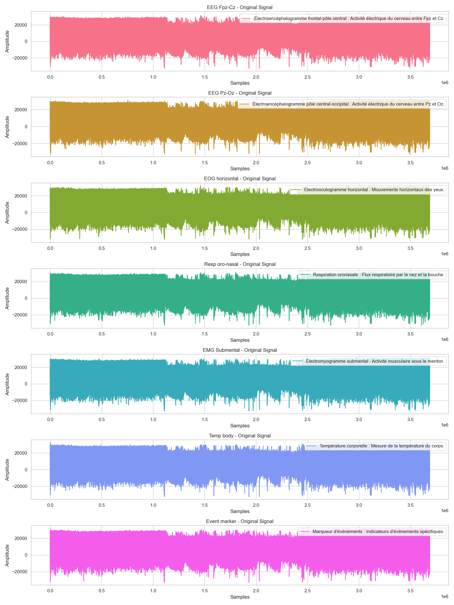
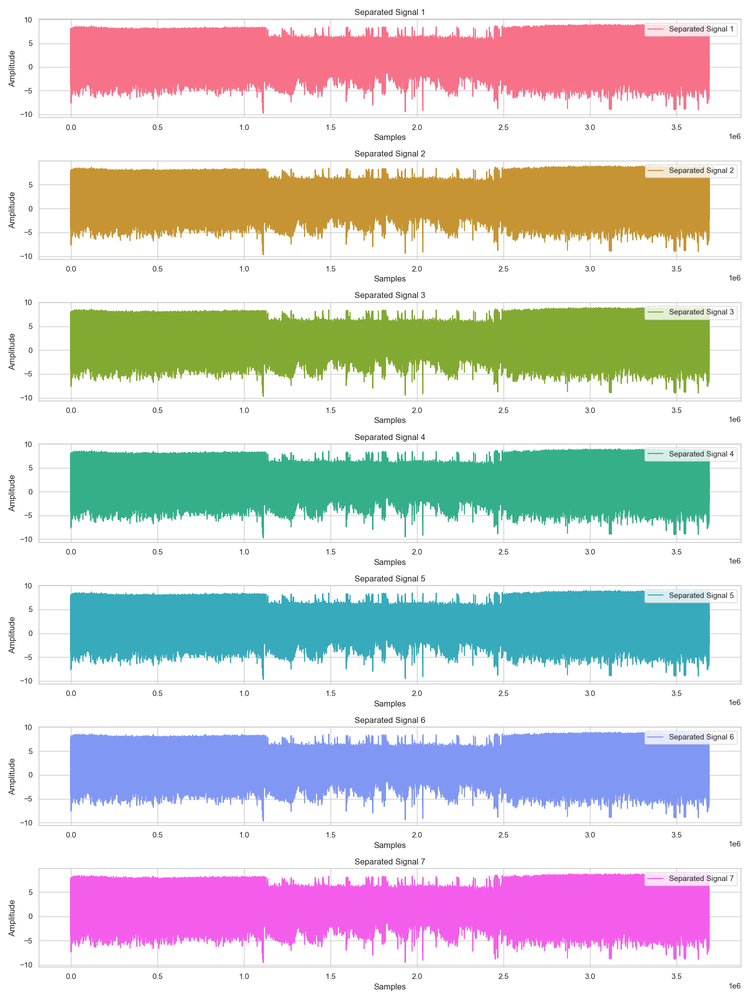
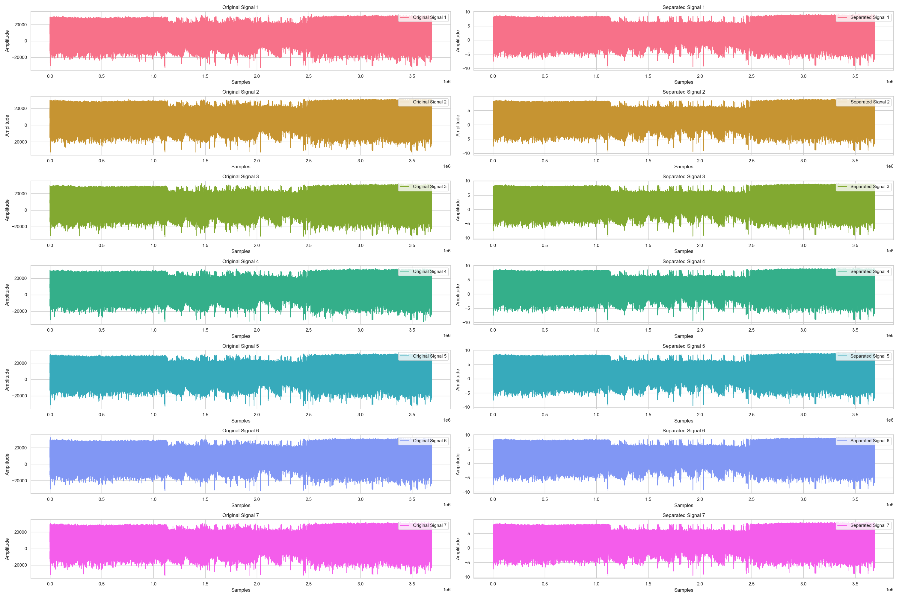
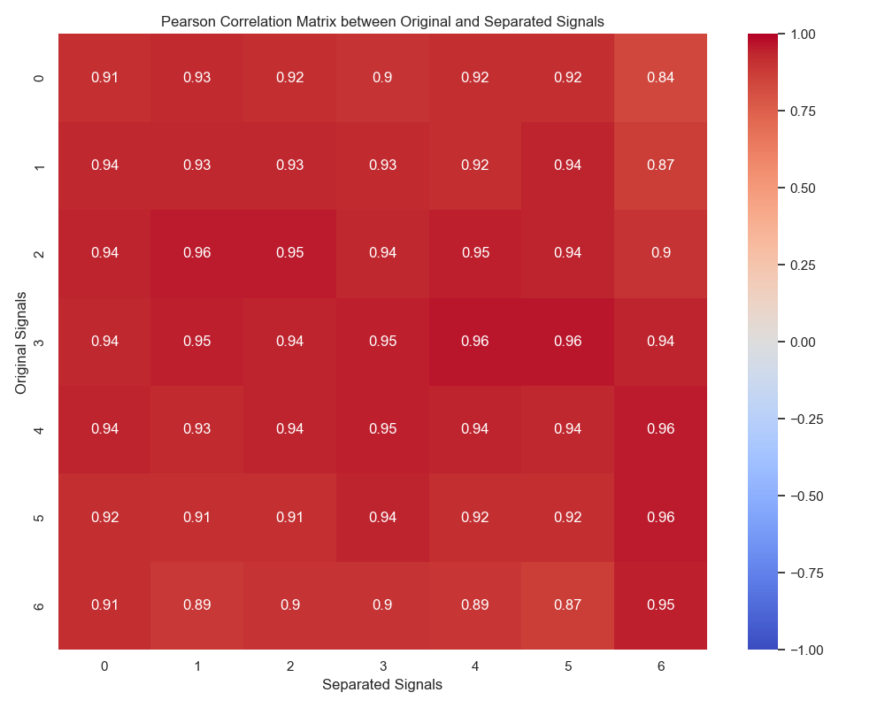
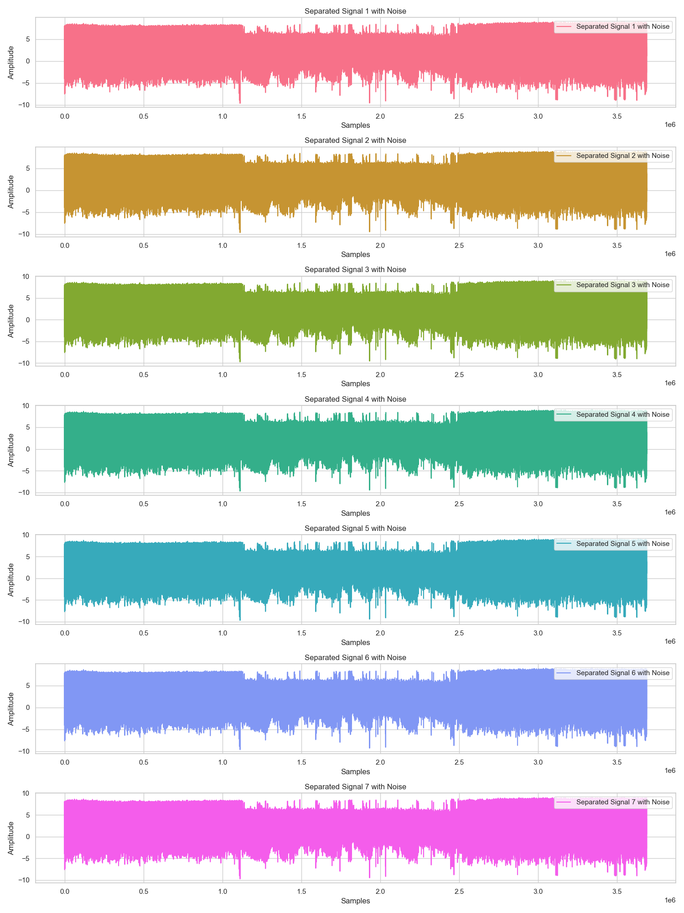
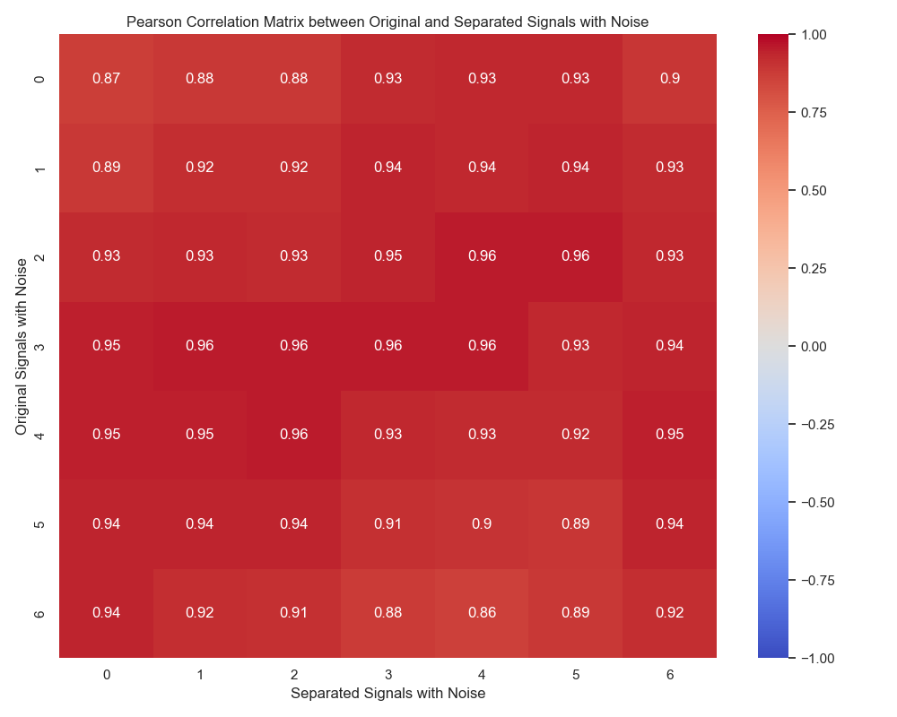
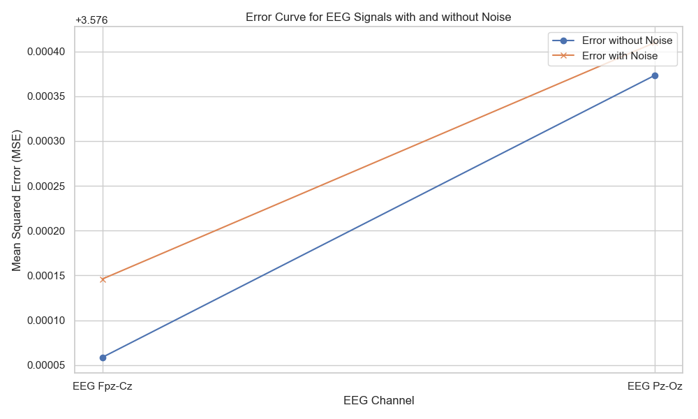

# -FastICABlindSeparation-on-Sleep-EDF-Database
Implementation of a blind source separation method using the FastICA algorithm from scratch, applied to polysomnographic data from the Sleep-EDF database.

This project demonstrates the implementation of a blind source separation method using the FastICA algorithm, which is built from scratch. The dataset used is from the [PhysioNet Sleep-EDF database](https://physionet.org/content/sleep-edf/1.0.0/), which contains polysomnographic recordings.

## Table of Contents

- [Introduction](#introduction)
- [Dataset](#dataset)
- [Installation](#installation)
- [Usage](#usage)
- [Project Structure](#project-structure)
- [Results](#results)
- [Acknowledgements](#acknowledgements)

## Introduction

The goal of this project is to separate mixed signals into their original source components using the FastICA algorithm. FastICA (Fast Independent Component Analysis) is a widely used algorithm for blind source separation. The implementation is done from scratch without using any built-in ICA libraries to understand the intricacies of the algorithm.

## Dataset

The dataset used in this project is from the Sleep-EDF Database, which includes various polysomnographic signals such as EEG, EOG, EMG, and respiratory signals. The specific file used in this project is `sc4002e0.rec`.

## Installation

To run this project, you need to have Python installed along with the following libraries:

- numpy
- matplotlib
- seaborn
- scikit-learn
- scipy

You can install the required libraries using the following command:

```bash
pip install numpy matplotlib seaborn scikit-learn scipy


## Usage

1. Clone the repository:

    ```bash
    git clone https://github.com/YoussefBOUNOU/-FastICABlindSeparation-on-Sleep-EDF-Database.git
    cd YOUR_REPOSITORY_NAME
    ```

2. Run the Jupyter notebook to see the implementation and results:

    ```bash
    jupyter notebook FastICAFV.ipynb
    ```

3. Alternatively, you can run the Python script:

    ```bash
    python FastICAFV.py
    ```


## Project Structure

- `FastICAFV.ipynb`: The main Jupyter notebook containing the implementation and visualization.
- `FastICAFV.py`: The Python script version of the notebook.
- `sleepDataset/`: Directory containing the dataset file `sc4002e0.rec`.
- `original_signals.png`: Visualization of the original signals.
- `separated_signals.png`: Visualization of the separated signals.
- `compare_signals.png`: Comparison of original and separated signals.
- `correlation_matrix.png`: Correlation matrix between original and separated signals.
- `separated_signals_noise.png`: Visualization of the separated signals with added noise.
- `correlation_matrix_noise.png`: Correlation matrix between original and separated signals with noise.
- `eeg_error_curve.png`: Error curve for EEG signals with and without noise.


## Results

### Original Signals


### Separated Signals


### Comparison of Original and Separated Signals


### Correlation Matrix


### Separated Signals with Noise


### Correlation Matrix with Noise


### Error Curve for EEG Signals



## Acknowledgements

- The dataset used in this project is from the [PhysioNet Sleep-EDF database](https://physionet.org/content/sleep-edf/1.0.0/).
- This project was inspired by the need to understand and implement blind source separation using FastICA from scratch.

